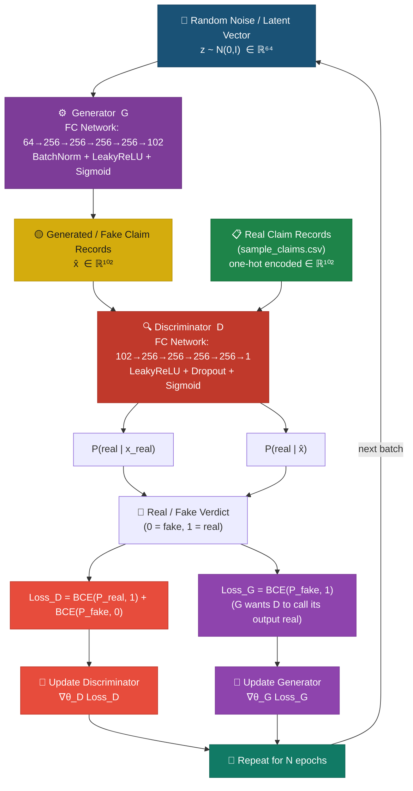

# GAN-Based Safety Data Generation — Architecture & Documentation

> **Project**: HackerRank Orchestrate — AI-Based Visual Evidence Verification for Damage Claims  
> **Component**: Experimental / Proposed — GAN for synthetic claim record generation  
> **Status**: Implementation complete. Training not yet run on production data.

---

## 1. What is a GAN?

A **Generative Adversarial Network (GAN)** is a deep learning framework introduced by
Goodfellow et al. (2014). It consists of two neural networks that are trained simultaneously
in an adversarial game:

| Network | Role |
|---|---|
| **Generator (G)** | Learns to create synthetic data samples that resemble the real training distribution |
| **Discriminator (D)** | Learns to distinguish real samples from samples produced by the Generator |

The Generator improves by fooling the Discriminator.  
The Discriminator improves by catching fakes.  
Through this competition, both networks improve iteratively until the Generator can
produce samples that are indistinguishable from real data.

**Simple analogy**: G is a counterfeiter learning to forge banknotes; D is a detective
learning to spot forgeries. Both get better through practice.

---

## 2. Why a GAN for the Safety / Claim Verification Module?

The HackerRank Orchestrate pipeline verifies damage claims for **cars, laptops, and packages**.
The current real dataset contains only **21 labeled sample rows** and **44 test rows** —
an extremely small corpus for training any data-driven model.

A GAN is being considered to:

| Use Case | Benefit |
|---|---|
| **Dataset augmentation** | Generate additional synthetic claim records to expand the training set |
| **Rare scenario coverage** | Produce examples of unusual claim patterns (e.g., manipulated images, rare part-issue combinations) |
| **Pipeline stress testing** | Generate edge-case inputs for the 7-stage claim verification pipeline |
| **Model evaluation diversity** | Create diverse test scenarios beyond the 44 provided test cases |

> **Important limitation**: GAN-generated records are **synthetic approximations of the
> real distribution** — they are never ground-truth evidence that a safety event occurred.
> They may only be used to diversify training data or test pipeline robustness.

---

## 3. Architecture Diagram

### 3.1 Mermaid Source (regeneratable)



### 3.2 ASCII Diagram (for documentation / slides)

```
  ┌─────────────────────────────────────────────────────────────────┐
  │           GAN-Based Safety Data Generation Architecture          │
  └─────────────────────────────────────────────────────────────────┘

  z ~ N(0, I)  ∈ ℝ⁶⁴
  (Random Latent Vector)
          │
          ▼
  ┌───────────────────┐
  │    Generator  G   │   FC Network: 64→256→256→256→256→102
  │  (7d3c98 purple)  │   BatchNorm + LeakyReLU + Sigmoid
  └────────┬──────────┘
           │
           ▼
  Generated Claim Records x̂  ∈ ℝ¹⁰²
  (FAKE — synthetic, one-hot encoded)
           │
           │                      Real Claim Records x  ∈ ℝ¹⁰²
           │                      (from sample_claims.csv)
           │                               │
           ▼                               ▼
  ┌─────────────────────────────────────────────────────┐
  │                  Discriminator  D                    │
  │        FC Network: 102→256→256→256→256→1             │
  │        LeakyReLU + Dropout(0.3) + Sigmoid            │
  └──────────────────────────┬──────────────────────────┘
                             │
                             ▼
                    P(real) ∈ [0, 1]
                   Real=1 / Fake=0
                             │
               ┌─────────────┴─────────────┐
               ▼                           ▼
       Loss_D = BCE(P_real, 1)     Loss_G = BCE(P_fake, 1)
             + BCE(P_fake, 0)      (G wants D to output 1
                                    for fake samples)
               │                           │
               ▼                           ▼
     Update Discriminator          Update Generator
       ∇θ_D  Loss_D                  ∇θ_G  Loss_G
               │                           │
               └─────────────┬─────────────┘
                             ▼
                   Repeat for 2000 epochs
```

---

## 4. What the Generator Does

The Generator **G** takes a random noise vector `z` sampled from a standard
Gaussian distribution and maps it to a vector in the same feature space as a
real claim record.

- **Input**: `z ∈ ℝ⁶⁴`  — 64-dimensional random latent vector
- **Architecture**: 4 hidden layers × 256 neurons, BatchNorm + LeakyReLU, Sigmoid output
- **Output**: `x̂ ∈ ℝ¹⁰²`  — continuous approximation of a one-hot claim record

After training, the Generator can produce **new synthetic claim records** by sampling
a fresh `z` vector — no access to real data required at generation time.

---

## 5. What the Discriminator Does

The Discriminator **D** takes any encoded claim record (real or generated) and
outputs a single probability: **P(the input is from the real dataset)**.

- **Input**: `x ∈ ℝ¹⁰²`  — encoded claim record (real or generated)
- **Architecture**: 4 hidden layers × 256 neurons, LeakyReLU + Dropout(0.3), Sigmoid output
- **Output**: `p ∈ [0, 1]`  — probability that the input is real

The Discriminator is discarded after training; only the Generator is used
to produce new samples.

---

## 6. How Adversarial Training Works

Each training step consists of two updates:

### Step 1 — Train the Discriminator
1. Feed real claim records → D should output ≈ 1
2. Feed Generator output (fake) → D should output ≈ 0
3. Compute `Loss_D = BCE(D(x_real), 1) + BCE(D(G(z)), 0)`
4. Backpropagate through D only (G's weights are frozen)

### Step 2 — Train the Generator
1. Sample fresh noise `z`, generate fake samples
2. Feed fakes through D
3. Compute `Loss_G = BCE(D(G(z)), 1)` — G wants D to output 1 (call its output "real")
4. Backpropagate through G only (D's weights are frozen)

This alternating update is repeated for 2,000 epochs with Adam optimiser
(lr=2e-4, β₁=0.5, β₂=0.999).

---

## 7. Feature Space — What Goes In and What Comes Out

### Input features (encoded from `sample_claims.csv`)

| Feature | Type | Values | One-hot dim |
|---|---|---|---|
| `claim_object` | categorical | car / laptop / package | 3 |
| `claim_status` | categorical | supported / contradicted / not_enough_information | 3 |
| `issue_type` | categorical | dent / scratch / crack / … (12 values) | 12 |
| `object_part` | categorical | front_bumper / screen / box / … (27 values) | 27 |
| `severity` | categorical | none / low / medium / high / unknown | 5 |
| `valid_image` | binary | true / false | 2 |
| `evidence_standard_met` | binary | true / false | 2 |

**Total input dimension**: 3+3+12+27+5+2+2 = **54** features encoded as one-hot vectors

> Note: `user_claim` (free text) and `image_paths` are excluded —
> the GAN operates on structured label fields only.

### Generator output

A synthetic claim record with the same fields, decoded by argmax per feature slice:

```csv
claim_object,claim_status,issue_type,object_part,severity,valid_image,evidence_standard_met,_synthetic_tag
car,supported,dent,door,medium,true,true,GAN_GENERATED
laptop,not_enough_information,crack,screen,unknown,false,false,GAN_GENERATED
```

The `_synthetic_tag=GAN_GENERATED` column prevents these rows from being confused
with real claim data.

---

## 8. How Generated Samples Could Be Used

1. **Dataset augmentation**: Add synthetic rows to `sample_claims.csv` before
   fine-tuning a downstream classifier.
2. **Edge-case generation**: Sample many records and filter for rare combinations
   (e.g., `claim_status=contradicted` + `severity=high` + `claim_object=package`).
3. **Pipeline stress testing**: Feed generated records through the 7-stage
   claim verification pipeline to test boundary conditions.
4. **Prompt engineering support**: Use generated claim descriptions as variation
   seeds when writing new LLM prompts.

---

## 9. Limitations

| Limitation | Detail |
|---|---|
| **Tiny real dataset** | 21 rows is far below the recommended minimum for GAN training. Results will not generalise well without more data. |
| **Text fields excluded** | `user_claim` (free text) and `image_paths` are not modelled. Generated records lack these fields. |
| **Images not generated** | This GAN produces structured labels, not pixel-level images. |
| **No convergence guarantee** | GANs are notoriously unstable. Loss values must be inspected manually. |
| **Not production-integrated** | Generated records are experimental and have not been validated by domain experts. |
| **No quality metric** | No FID, MMD, or coverage metric has been computed yet (requires a larger dataset). |

---

## 10. Implementation Status

| Component | Status |
|---|---|
| `code/gan/config.py` | ✅ Complete |
| `code/gan/dataset.py` | ✅ Complete |
| `code/gan/generator.py` | ✅ Complete |
| `code/gan/discriminator.py` | ✅ Complete |
| `code/gan/utils.py` | ✅ Complete |
| `code/gan/train.py` | ✅ Complete |
| `code/gan/README.md` | ✅ Complete |
| Architecture diagram (Mermaid) | ✅ Complete — see `docs/gan_architecture.md` |
| **Actual training run** | ❌ Not yet run — requires `torch` installation and GPU/MPS |
| **Loss curve review** | ❌ Pending training |
| **Generated sample quality review** | ❌ Pending training |
| **Integration with claim pipeline** | ❌ Proposed only — not wired into `code/main.py` |

> The GAN is currently an **experimental / proposed component**.
> The existing 7-stage claim verification pipeline (`code/main.py`) is unchanged.

---

## 11. How to Run

```bash
# 1. Install dependencies (from repo root)
pip install torch torchvision

# 2. Smoke-test the dataset loader
python -c "from code.gan.dataset import get_dataset; ds = get_dataset(); print(len(ds), 'rows')"

# 3. Run training (real data — 21 rows, 2000 epochs)
python code/gan/train.py

# 4. Run training with DEMO/SYNTHETIC data (no real data required)
python code/gan/train.py --no-real --epochs 500

# 5. Override hyperparameters
python code/gan/train.py --epochs 5000 --latent 128 --lr-g 1e-4 --lr-d 1e-4

# 6. Resume from checkpoint
python code/gan/train.py --resume code/gan/output/checkpoints/epoch_1999.pt
```

Output is written to:
- `code/gan/output/checkpoints/` — `.pt` checkpoint files
- `code/gan/output/samples/` — synthetic CSV rows (labelled `GAN_GENERATED`)
- `code/gan/output/metrics.json` — training loss history

---

## 12. Explanation for Mentor / Professor

> *"We implemented a Generative Adversarial Network (GAN) as an experimental data
> augmentation component for the damage-claim verification pipeline.*
>
> *The Generator network learns to produce synthetic claim records — structured data
> describing damage type, object part, severity, and claim status — by observing the
> statistical distribution of real labeled claims. The Discriminator network acts as
> an adversarial judge, learning to distinguish real records from generated ones.*
>
> *Through iterative adversarial training, both networks improve: the Generator
> produces more realistic records, and the Discriminator becomes a better critic.*
>
> *The primary motivation is data scarcity: the dataset contains only 21 labeled
> sample rows, which limits downstream model training. A trained Generator could
> produce thousands of additional synthetic records to diversify the training set.*
>
> *The GAN is currently an experimental component. It is fully implemented in PyTorch
> and supports CUDA, Apple Silicon MPS, and CPU. The existing claim-verification
> pipeline is not modified — the GAN is a standalone addition under `code/gan/`."*
